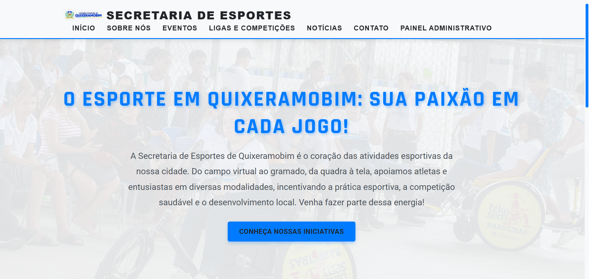
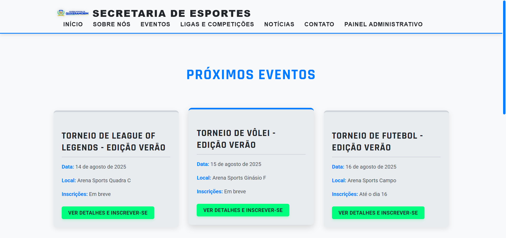
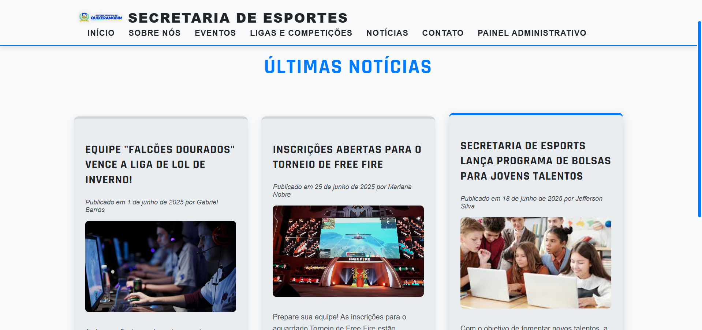
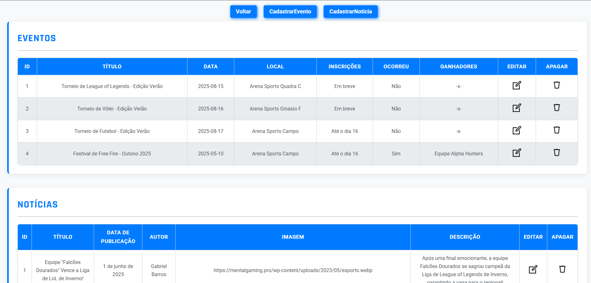

# 🏀 Projeto de Extensão – Secretaria de Esportes

Este é um **site institucional** desenvolvido como parte de um **projeto de extensão** acadêmico para a **Secretaria de Esportes da minha cidade**. 

O objetivo do projeto é oferecer uma plataforma simples e eficiente para a divulgação de **eventos esportivos**, **notícias**, **projetos sociais** e demais atividades promovidas pela secretaria, facilitando o acesso da comunidade às informações.

> ⚠️ Este projeto foi criado com fins **estudantis** e **não oficiais**, como forma de aplicar na prática os conhecimentos em desenvolvimento web.

---

## 🛠️ Tecnologias Utilizadas

Este projeto foi desenvolvido com as seguintes tecnologias:

### 🔹 Front-end
- **HTML**
- **CSS**
- **JavaScript**
- **Axios** – Utilizado para o consumo de APIs e comunicação com o backend

### 🔹 Back-end
- **Node.js**
- **Express.js**

### 🗂️ Gerenciamento do Projeto
- **Jira** – Utilizado para organização das tarefas e acompanhamento do progresso
- **Metodologia Ágil (Scrum)** – Aplicada para planejar e conduzir as etapas do desenvolvimento, buscando maior eficiência e entrega contínua